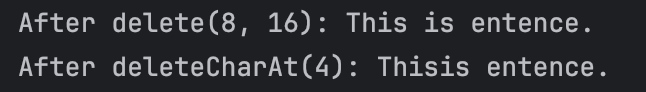

# Exploring Java `StringBuilder`
Submitted by: Baruc, Jana Enigma S.

### Exercise 1: `append()` - Appending Content
1. **Prediction**: `Hello, Cadets!`
    * This is because the `append()` method simply adds the new string after the declared string in `StringBuilder`.
2. **Observation/Output**

### Exercise 2: `insert()` - Inserting Content at a Position
1. **Prediction**: `Java is really great!`
    * This is because the `insert()` method inserts the new string at the index given.
2. **Observation/Output**

### Exercise 3: `delete()` - Deleting Content
1. **Prediction**: `After delete(8, 16): This is entence.`, `After deleteCharAt(4): Thisis entence`
    * The `delete(8, 16)` deletes the string from index 8 up to index 16. The `deleteCharAt(4)` deletes the character at index 4.
2. **Observation/Output**

