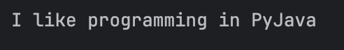
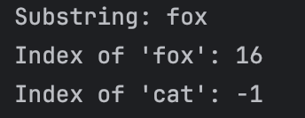
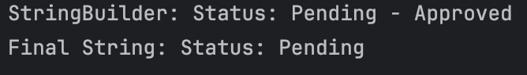

# Exploring Java `StringBuilder`
Submitted by: Baruc, Jana Enigma S.

### Exercise 1: `append()` - Appending Content
1. **Prediction**: `Hello, Cadets!`
    * This is because the `append()` method simply adds the new string after the declared string in `StringBuilder`.
2. **Observation/Output**

### Exercise 2: `insert()` - Inserting Content at a Position
1. **Prediction**: `Java is really great!`
    * This is because the `insert()` method inserts the new string at the index given.
2. **Observation/Output**

### Exercise 3: `delete()` - Deleting Content
1. **Prediction**: `After delete(8, 16): This is entence.`, `After deleteCharAt(4): Thisis entence.`
    * The `delete(8, 16)` method deletes the string from index 8 up to index 16. The `deleteCharAt(4)` deletes the character at index 4.
2. **Observation/Output**

### Exercise 4: `replace()` - Replacing a Section
1. **Prediction**: `I like programming in PyJava`
    * The `replace(24, 30, "Java")` method replaces the string from index 24 up to index 30 with the string "Java".
2. **Observation/Output**

### Exercise 5: Method Chaining
1. **Prediction**: `Ready, Set, rt...`
    * The `append(...)` method adds the string "..." after the string in `StringBuilder`. The `insert(0, "Ready, Set, ")` inserts the string "Ready, Set, " at index 0. `delete(12, 15)` removes the string beginning at index 12, but stopping before it reaches index 15.
2. **Observation/Output**

### Exercise 6: `substring()`, `indexOf()`, and Non-Existing Words
1. **Prediction**: `Substring: fox`, `Index of 'fox': 16`, `Index of 'cat': -1`
    * The `substring(16, 19)` method returns the substring beginning at index 16 and ending at index 18 (index 19-1). The `indexOf("fox")` method returns the index where the string "fox" begins. Similar to String, `indexOf()` will return -1 if the string does not exist in the StringBuilder.
2. **Observation/Output**

### Exercise 7: `toString()` - Converting back to a String
1. **Prediction**: `StringBuilder: Status: Pending - Approved`, `Final String: Status: Pending`
    * Since we converted `sb` into a string before we appended " - Approved" to the StringBuilder, the final string only printed "Status: Pending" because unlike StringBuilders, a String is immutable and cannot be modified anymore.
2. **Observation/Output**

